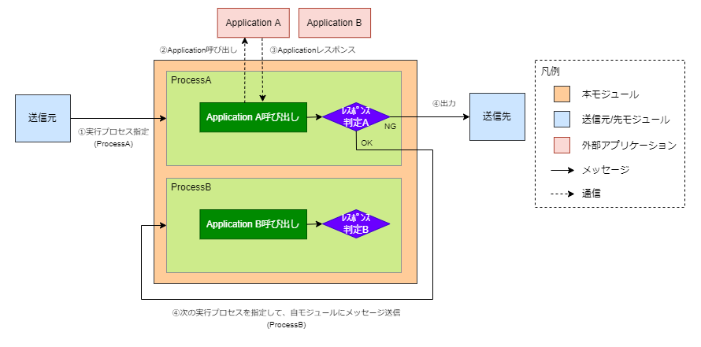
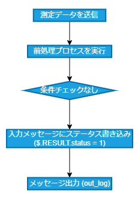
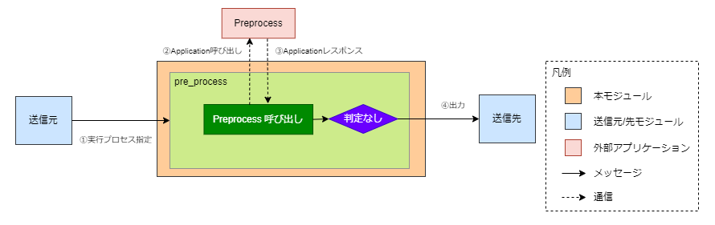
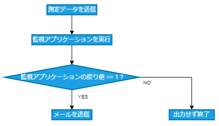
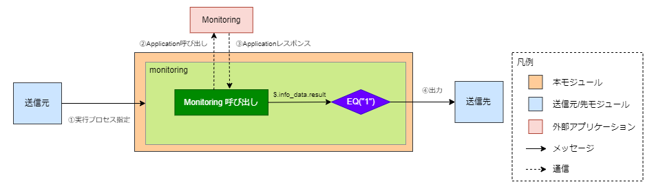
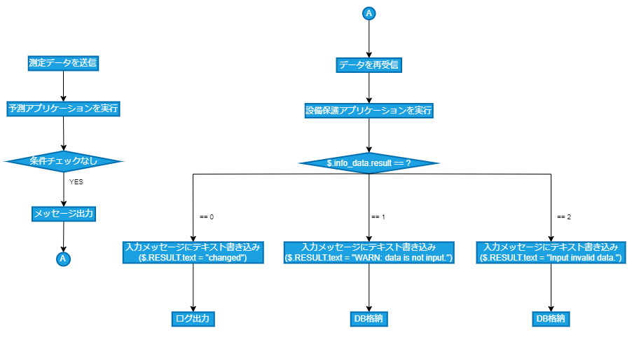
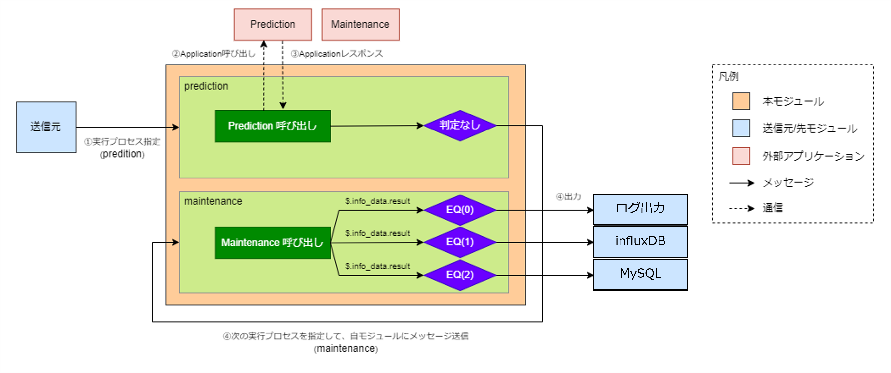

# ApplicationController

## 目次
* [概要](#概要)
* [機能](#機能)
* [Quick Start](#quick-start)
* [イメージのURL](#イメージのurl)
* [動作保証環境](#動作保証環境)
* [Deployment 設定値](#deployment-設定値)
  * [環境変数](#環境変数)
  * [Desired Properties](#desired-properties)
  * [Create Option](#create-option)
  * [startupOrder](#startuporder)
* [受信メッセージ](#受信メッセージ)
  * [Message Body](#message-body)
  * [Message Properties](#message-properties)
* [Http Application実行](#http-application実行)
  * [リクエスト](#リクエスト)
  * [レスポンス](#レスポンス)
* [送信メッセージ](#送信メッセージ)
  * [Message Body](#SendMessageBody)
  * [Message Properties](#SendMessageProperties)
* [Direct Method](#direct-method)
  * [SetLogLevel](#setloglevel)
  * [GetLogLevel](#getloglevel)
* [ログ出力内容](#ログ出力内容)
* [ユースケース](#ユースケース)
  * [ケース ①](#Usecase1)
  * [ケース ②](#Usecase2)
  * [ケース ③](#Usecase3)
* [Feedback](#Feedback)
* [LICENSE](#LICENSE)

## 概要
ApplicationControllerは、メッセージ受信をトリガに、事前に設定されたプロセスを実行し、結果を出力するAzure IoT edgeモジュールです。

## 機能
ApplicationControllerは、以下のような処理を実行する<br>
① 受信メッセージのプロパティで指定されたプロセスを実行する<br>
② 内部でアプリケーションを呼び出す<br>
③ 外部アプリケーションのレスポンスを受け取る<br>
④ 後処理としてメッセージを送信する。その際に次に実行するプロセス名を指定して別のプロセスを再実行することも可能



## Quick Start
1. Personal Accese tokenを作成
（参考: [個人用アクセス トークンを管理する](https://docs.github.com/ja/authentication/keeping-your-account-and-data-secure/managing-your-personal-access-tokens)）

2. リポジトリをクローン
```
git clone https://github.com/Project-GAUDI/ApplicationController.git
```

3. ./src/nuget_template.configの<GITHUB_USERNAME>と<PERSONAL_ACCESS_TOKEN>を自身のユーザー名とPersonal Accese tokenに書き換えて、ファイル名をnuget.configに変更

4. Dockerイメージをビルド
```
docker image build -t <IMAGE_NAME> ./ApplicationController/src/
```
例）
```
docker image build -t ghcr.io/<YOUR_GITHUB_USERNAME>/applicationcontroller:<VERSION> ./ApplicationController/src/
```

5. Dockerイメージをコンテナレジストリにプッシュ
```
docker push <IMAGE_NAME>
```
例）
```
docker push ghcr.io/<YOUR_GITHUB_USERNAME>/applicationcontroller:<VERSION>
```

6. Azure IoT edgeで利用

## イメージのURL
準備中
| URL                                                             | Description         |
| --------------------------------------------------------------- | ------------------- |

## 動作保証環境

| Module Version | IoTEdge | edgeAgent | edgeHub  | amd64 verified on | arm64v8 verified on | arm32v7 verified on |
| -------------- | ------- | --------- | -------- | ----------------- | ------------------- | ------------------- |
| 6.0.0          | 1.5.0   | 1.5.6     | 1.5.6    | ubuntu22.04       | －                  | －                  |

## Deployment 設定値

### 環境変数

#### 環境変数の値

| Key                       | Required | Default | Recommend | Description                                                     |
| ------------------------- | -------- | ------- | --------- | ---------------------------------------------------------------- |
| TransportProtocol         |          | Amqp    |           | ModuleClient の接続プロトコル。<br>["Amqp", "Mqtt"] |
| LogLevel                  |          | info    |           | 出力ログレベル。<br>["trace", "debug", "info", "warn", "error"] |
| HttpTimeout               |          | 10      |           | http 通信時のタイムアウト時間。                                                         |

### Desired Properties

#### Desired Properties の値

| JSON Key                                               | Type   | Required | Default | Recommend | Description                                                                |
| ------------------------------------------------------ | ------ | -------- | ------- | --------- | ------------------------------------------------------------------------   |
| input_name                                             | string | ○        |         |           | メッセージの入力トピック名                                                                           |
| processes                                              | array  | ○        |         |           | プロセス設定配列                                                                                     |           |
| &nbsp; {}                                              | object |          |         |           | プロセス設定                                                                                         |
| &nbsp;&nbsp; process_name                              | string | ○        |         |           | 実行プロセス名<br>入力メッセージの"process_name"プロパティにマッチした名前があるとそのプロセスを実行 |
| &nbsp;&nbsp; application                               | object | ○        |         |           | 実行アプリケーション                                                                                 |
| &nbsp;&nbsp;&nbsp; type                                | string | ○        |         |           | プロトコルタイプ<br>["http", "gRPC"(未実装)]                                                         |
| &nbsp;&nbsp;&nbsp; url                                 | string | ○        |         |           | 呼び出す WebAPP の URL (type="http" 指定時必須)<br>replace_params で部分置換可能                     |
| &nbsp;&nbsp;&nbsp; replace_params                      | array  |          |         |           | URL の文字置換パラメータ配列 (type="http" 指定時有効)                                                |
| &nbsp;&nbsp;&nbsp;&nbsp; {}                            | object |          |         |           | URL の文字置換パラメータ                                                                             |
| &nbsp;&nbsp;&nbsp;&nbsp;&nbsp; base_name               | string | ○        |         |           | 置換元文字列 (replace_params 指定時必須)<br>url に含まれる必要あり                                   |
| &nbsp;&nbsp;&nbsp;&nbsp;&nbsp; source_data_type        | string | ○        |         |           | 受信メッセージから取り出す置換文字列取得元 (replace_params 指定時必須)<br>["Body", "Properties"]     |
| &nbsp;&nbsp;&nbsp;&nbsp;&nbsp; source_data_key         | string | ○        |         |           | 取得元データパス (replace_params 指定時必須)<br>[取得元データパス (JSONPath※1), プロパティ名]        |
| &nbsp;&nbsp; post_processes                            | array  |          |         |           | 後処理設定配列                                                                                       |
| &nbsp;&nbsp;&nbsp; {}                                  | object |          |         |           | 後処理設定<br>condition があれば満たせば tasks を実行, なければ無条件で実行                          |
| &nbsp;&nbsp;&nbsp;&nbsp; condition_path                | string | ○        |         |           | 実行条件元データパス (JSONPath※1)                                                                    |
| &nbsp;&nbsp;&nbsp;&nbsp; condition_operator            | string | ○        |         |           | 実行条件構文※2                                                                                       |
| &nbsp;&nbsp;&nbsp;&nbsp; tasks                         | array  | ○        |         |           | タスク設定配列                                                                                       |
| &nbsp;&nbsp;&nbsp;&nbsp;&nbsp; {}                      | object |          |         |           | タスク設定                                                                                           |
| &nbsp;&nbsp;&nbsp;&nbsp;&nbsp;&nbsp; output_name       | string | ○        |         |           | メッセージの出力トピック名                                                                           |
| &nbsp;&nbsp;&nbsp;&nbsp;&nbsp;&nbsp; next_process      | string |          |         |           | 次実行プロセス名<br>連続して実行させたい場合、これを指定して自モジュールにメッセージ送信すればよい   |
| &nbsp;&nbsp;&nbsp;&nbsp;&nbsp;&nbsp; set_values        | array  |          |         |           | 出力に設定するデータ配列                                                                             |
| &nbsp;&nbsp;&nbsp;&nbsp;&nbsp;&nbsp;&nbsp; {}          | object |          |         |           | 出力に設定するデータ                                                                                 |
| &nbsp;&nbsp;&nbsp;&nbsp;&nbsp;&nbsp;&nbsp;&nbsp; type  | string | ○        |         |           | 出力先 (set_values 指定時必須)<br>["Body", "Properties"]                                             |
| &nbsp;&nbsp;&nbsp;&nbsp;&nbsp;&nbsp;&nbsp;&nbsp; key   | string | ○        |         |           | 出力先データパス (set_values 指定時必須)<br>[出力設定パス (JSONPath※1), プロパティ名]                |
| &nbsp;&nbsp;&nbsp;&nbsp;&nbsp;&nbsp;&nbsp;&nbsp; value | string | ○        |         |           | 出力設定データ (set_values 指定時必須)                                                               |

※1 JSONPath
* 記法
  [https://github.com/json-path/JsonPath#operators (外部リンク)](https://github.com/json-path/JsonPath#operators)
* 制限
  ".." や "[ \* ]" による複数の対象を指定することはできない

※2 実行条件構文

以下のものが使用可能

| 構文         | 説明                                                                                                                                                                      |
| ------------ | ------------------------------------------------------------------------------------------------------------------------------------------------------------------------- |
| BETWEEN(A,B) | A 以上 B 以下のデータを取得する。<span style="color:skyblue;">(未実装)</span>                                                                                             |
| EQ(A)        | A と一致するデータを取得する。                                                                                                                                            |
| NE(A)        | A と一致しないデータを取得する。 <span style="color:skyblue;">(未実装)</span>                                                                                             |
| LT(A)        | A より小さいデータを取得する。 <span style="color:skyblue;">(未実装)</span>                                                                                               |
| LE(A)        | A 以下のデータを取得する。 <span style="color:skyblue;">(未実装)</span>                                                                                                   |
| GT(A)        | A より大きいデータを取得する。 <span style="color:skyblue;">(未実装)</span>                                                                                               |
| GE(A)        | A 以上のデータを取得する。 <span style="color:skyblue;">(未実装)</span>                                                                                                   |
| LIKE(A)      | A とパターンマッチングするデータを取得する。<span style="color:skyblue;">(未実装)</span><br>以下の特殊文字が利用可能。<br>%:任意の 0 文字以上の文字列<br>\_:任意の 1 文字 |

#### Desired Properties の記入例

```json
{
  "input_name": "input",
  "processes": [
    {
      "process_name": "pre_process",
      "application": {
        "type": "http",
        "url": "http://Preprocess-<machinenumber>-<dienumber>:5001/score",
        "replace_params": [
          {
            "base_name": "<machinenumber>",
            "source_data_type": "Body",
            "source_data_key": "$.target.machinenumber"
          },
          {
            "base_name": "<dienumber>",
            "source_data_type": "Properties",
            "source_data_key": "die_number"
          }
        ]
      },
      "post_processes": [
        {
          "condition_path": "info_data/result",
          "condition_operator": "EQ(\"9\")",
          "tasks": [
            {
              "output_name": "out_view1",
              "next_process": "monitoring",
              "set_values": [
                {
                  "type": "Body",
                  "key": "$.RESULT.status",
                  "value": "10"
                }
              ]
            }
          ]
        }
      ]
    }
  ]
}
```

### Create Option

#### Create Option の値

なし

#### Create Option の記入例

```json
{}
```


### startupOrder

#### startupOrder の値

| JSON Key      | Type    | Required | Default | Recommend | Description |
| ------------- | ------- | -------- | ------- | --------- | ----------- |
| startupOrder  | uint    |  | 4294967295 | 400 | モジュールの起動順序。数字が小さいほど先に起動される。<br>["0"から"4294967295"] |

#### startupOrder の記入例

```json
{
  "startupOrder": 400
}
```

## 受信メッセージ

### Message Body

任意のJSON形式データ。<br>
実行アプリケーションの入力データとして使用。

### Message Properties

| Key          | Description    |
| ------------ | -------------- |
| process_name | 実行プロセス名 |

## Http Application実行

### リクエスト

以下の手順でurlを決定し、Http Applicationを実行する。<br>
① Desired Propertiesのprocessesから"process_name"が<br>
  受信メッセージのMessage Propertiesの"process_name"と一致する"プロセス設定"を選択。<br>
② ①の実行アプリケーション("application")の"url"と"replace_params"を取り出し、<br>
  "replace_params"の設定に従い、urlの文字列を変換する。<br>
③ ②のurlに対し、受信メッセージのBodyをリクエストデータとしてアクセスする。

### レスポンス

任意のJSON形式データ。ただし下記が含まれること。<br>
* 後処理でステータスの判定がある場合、判定対象のデータ。<br>
* 次実行プロセスの指定がある場合、次実行プロセスの入力データとして必要な情報。

## 送信メッセージ

<a id="SendMessageBody"></a>

### Message Body

実行アプリケーションのレスポンスに対し以下の値を追加または更新する。

| JSON Key            | Type   | Description |
| ------------------- | ------ | ----------- |
| Desired Properties の "set_values" で設定した key(JSONPath)<br>※type="Body"のみ対象 | string | Desired Properties の "set_values" で設定した value |

<a id="SendMessageProperties"></a>

### Message Properties

| Key                                                                             | Description                                         |
| ------------------------------------------------------------------------------- | --------------------------------------------------- |
| Desired Properties の "set_values" で設定した key<br>※type="Properties"のみ対象 | Desired Properties の "set_values" で設定した value |
| process_name                                                                    | next_process の指定時に設定, 未指定時は削除する |


## Direct Method

### SetLogLevel

* 機能概要

  実行中に一時的にLogLevelを変更する。<br>
  変更はモジュール起動中または有効時間を過ぎるまで有効。<br>

* payload

  | JSON Key      | Type    | Required | default | Description |
  | ------------- | ------- | -------- | -------- | ----------- |
  | EnableSec     | integer  | 〇       |          | 有効時間(秒)。<br>-1:無期限<br>0:リセット(環境変数LogLevel相当に戻る)<br>1以上：指定時間(秒)経過まで有効。  |
  | LogLevel      | string  | △       |          | EnableSec=0以外を指定時必須。指定したログレベルに変更する。<br>["trace", "debug", "info", "warn", "error"]  |

  １時間"trace"レベルに変更する場合の設定例

  ```json
  {
    "EnableSec": 3600,
    "LogLevel": "trace"
  }
  ```

* response

  | JSON Key      | Type    | Description |
  | ------------- | ------- | ----------- |
  | status          | integer | 処理ステータス。<br>0:正常終了<br>その他:異常終了         |
  | payload          | object  | レスポンスデータ。         |
  | &nbsp; CurrentLogLevel | string  | 設定後のログレベル。（正常時のみ）<br>["trace", "debug", "info", "warn", "error"]  |
  | &nbsp; Error | string  | エラーメッセージ（エラー時のみ）  |

  ```json
  {
    "status": 0,
    "paylaod":
    {
      "CurrentLogLevel": "trace"
    }
  }
  ```

### GetLogLevel

* 機能概要

  現在有効なLogLevelを取得する。<br>
  通常は、LogLevel環境変数の設定値が返り、SetLogLevelで設定した有効時間内の場合は、その設定値が返る。<br>

* payload

  なし

* response

  | JSON Key      | Type    | Description |
  | ------------- | ------- | ----------- |
  | status          | integer | 処理ステータス。<br>0:正常終了<br>その他:異常終了         |
  | payload          | object  | レスポンスデータ。         |
  | &nbsp; CurrentLogLevel | string  | 現在のログレベル。（正常時のみ）<br>["trace", "debug", "info", "warn", "error"]  |
  | &nbsp; Error | string  | エラーメッセージ（エラー時のみ）  |

  ```json
  {
    "status": 0,
    "paylaod":
    {
      "CurrentLogLevel": "trace"
    }
  }
  ```

## ログ出力内容

| LogLevel | 出力概要 |
| -------- | -------- |
| error    | [初期化/desired更新/desired取り込み/メッセージ受信]失敗         |
| warn     | エッジランタイムとの接続リトライ失敗<br>環境変数の1部値不正         |
| info     | 環境変数の値<br>desired更新通知<br>環境変数の値未設定のためDefault値適用<br>メッセージ[送信/受信]通知         |
| debug    | 無し     |
| trace    | メソッドの開始・終了<br>受信メッセージBody  |

## ユースケース

<a id="Usecase1"></a>

### ケース ①

測定データを送信して前処理アプリケーションを実行。入力メッセージに処理ステータスを付与して出力する。




#### Desired Properties

```json
{
  "input_name": "input",
  "processes": [
    {
      "process_name": "pre_process",
      "application": {
        "type": "http",
        "url": "http://Preprocess-<value1>-<value2>:5001/score",
        "replace_params": [
          {
            "base_name": "<value1>",
            "source_data_type": "Body",
            "source_data_key": "$.RecordList[0].RecordData[0]"
          },
          {
            "base_name": "<value2>",
            "source_data_type": "Body",
            "source_data_key": "$.RecordList[0].RecordData[1]"
          }
        ]
      },
      "post_processes": [
        {
          "tasks": [
            {
              "output_name": "output1",
              "set_values": [
                {
                  "type": "Body",
                  "key": "$.RESULT.status",
                  "value": "1"
                }
              ]
            }
          ]
        }
      ]
    }
  ]
}
```

* 受信メッセージ

  ```json
  {
    "Body": {
      "RecordList": [
        {
          "RecordHeader": [
            "test_01.csv",
            "1"
          ],
          "RecordData": [
            "2",
            "5"
          ]
        }
      ]
    },
    "Property": {
      "process_name": "pre_process"
    }
  }
  ```

* 実行アプリケーションレスポンス

  url: `http://Preprocess-2-5:5001/score`のレスポンス例

  ```json
  {
    "info_data": {
      "result": "1"
    }
  }
  ```

* 送信メッセージ

  output トピック名: "output1"

  ```json
  {
    "Body": {
      "info_data": {
         "result": "1"
      },
      "RESULT": {
        "status": "1"
      }
    },
    "Property": {}
  }
  ```

<a id="Usecase2"></a>

### ケース ②

測定データを送信して監視アプリケーションを実行。アプリケーションの戻り値が"1"の場合、メールを送信する




#### Desired Properties

```json
{
  "input_name": "input",
  "processes": [
    {
      "process_name": "monitoring",
      "application": {
        "type": "http",
        "url": "http://Monitoring-<value1>:5001",
        "replace_params": [
          {
            "base_name": "<value1>",
            "source_data_type": "Body",
            "source_data_key": "$.RecordList[0].RecordData[0]"
          }
        ]
      },
      "post_processes": [
        {
          "condition_path": "$.info_data.result",
          "condition_operator": "EQ(\"1\")",
          "tasks": [
            {
              "output_name": "out_continue"
            }
          ]
        }
      ]
    }
  ]
}
```

* 受信メッセージ

  ```json
  {
    "Body": {
      "RecordList": [
        {
          "RecordHeader": [
            "test_01.csv",
            "1"
          ],
          "RecordData": [
            "2"
          ]
        }
      ]
    },
    "Property": {
      "process_name": "monitoring"
    }
  }
  ```

* 実行アプリケーションレスポンス

  url: `http://Monitoring-2:5001`のレスポンス例

  ```json
  {
    "RecordList": [
      {
        "RecordHeader": [
          "test_01.csv",
          "1"
        ],
        "RecordData": [
          "2"
        ]
      }
    ],
    "info_data": {
      "result": "1"
    }
  }
  ```

* 送信メッセージ
  output トピック名: "out_continue"

  ```json
  {
    "Body": {
      "RecordList": [
        {
          "RecordHeader": [
            "test_01.csv",
            "1"
          ],
          "RecordData": [
            "2"
          ]
        }
      ],
      "info_data": {
      "result": "1"
      }
    },
    "Property": {}
  }
  ```

  → 後のルーティングでメールを送信

<a id="Usecase3"></a>

### ケース ③

測定データを送信して予測アプリケーションを実行し出力を自身のモジュールで受けなおし、設備保護アプリケーションを実行する<br>出力には設備保護アプリケーションの結果ごとのテキストをセットしてDBに格納




#### Desired Properties

```json
{
  "input_name": "input",
  "processes": [
    {
      "process_name": "prediction",
      "application": {
        "type": "http",
        "url": "http://Prediction-<value1>:5001",
        "replace_params": [
          {
            "base_name": "<value1>",
            "source_data_type": "Body",
            "source_data_key": "$.RecordList[0].RecordData[0]"
          }
        ]
      },
      "post_processes": [
        {
          "tasks": [
            {
              "output_name": "out_continue",
              "next_process": "maintenance"
            }
          ]
        }
      ]
    },
    {
      "process_name": "maintenance",
      "application": {
        "type": "http",
        "url": "http://Maintenance:5001"
      },
      "post_processes": [
        {
          "condition_path": "$.info_data.result",
          "condition_operator": "EQ(\"0\")",
          "tasks": [
            {
              "output_name": "out_change1",
              "set_values": [
                {
                  "type": "Body",
                  "key": "$.RESULT.text",
                  "value": "changed"
                }
              ]
            }
          ]
        },
        {
          "condition_path": "$.info_data.result",
          "condition_operator": "EQ(\"1\")",
          "tasks": [
            {
              "output_name": "out_alert1",
              "set_values": [
                {
                  "type": "Body",
                  "key": "$.RESULT.text",
                  "value": "WARN: data is not input."
                }
              ]
            }
          ]
        },
        {
          "condition_path": "$.info_data.result",
          "condition_operator": "EQ(\"2\")",
          "tasks": [
            {
              "output_name": "out_alert2",
              "set_values": [
                {
                  "type": "Body",
                  "key": "$.RESULT.text",
                  "value": "Invalid data."
                }
              ]
            }
          ]
        }
      ]
    }
  ]
}
```
#### routes
```json
{
  "input1": "FROM /messages/modules/送信元/outputs/output INTO BrokeredEndpoint(\"/modules/ApplicationController/inputs/input\")",
  "reInput1": "FROM /messages/modules/ApplicationController/outputs/out_continue INTO BrokeredEndpoint(\"/modules/ApplicationController/inputs/input\")",
  "output1": "FROM /messages/modules/ApplicationController/outputs/out_change1 INTO BrokeredEndpoint(\"/modules/Logger/inputs/input\")",
  "output2": "FROM /messages/modules/ApplicationController/outputs/out_alert1 INTO BrokeredEndpoint(\"/modules/InfluxDBRegister/inputs/input\")",
  "output3": "FROM /messages/modules/ApplicationController/outputs/out_alert2 INTO BrokeredEndpoint(\"/modules/MySQLRegister/inputs/input\")"
}
```

* 受信メッセージ
  ```json
  {
    "Body": {
      "RecordList": [
        {
          "RecordHeader": [
            "test_01.csv",
            "1"
          ],
          "RecordData": [
            "2"
          ]
        }
      ]
    },
    "Property": {
      "process_name": "prediction"
    }
  }
  ```

* 実行アプリケーションレスポンス
  url: `http://Prediction-2:5001`のレスポンス例

  ```json
  {
    "RecordList": [
      {
        "RecordHeader": [
          "test_01.csv",
          "1"
        ],
        "RecordData": [
          "2"
        ]
      }
    ],
    "info_data": {
      "result": "1"
    }
  }
  ```

  url: `http://Maintenance:5001`のレスポンス例

  ```json
  {
    "RecordList": [
      {
        "RecordHeader": [
          "test_01.csv",
          "1"
        ],
        "RecordData": [
          "2"
        ]
      }
    ],
    "info_data": {
      "result": "2"
    }
  }
  ```

* 送信メッセージ
  output トピック名: "out_continue"

  ```json
  {
    "Body": {
      "RecordList": [
        {
          "RecordHeader": [
            "test_01.csv",
            "1"
          ],
          "RecordData": [
            "2"
          ]
        }
      ],
      "info_data": {
        "result": "1"
      }
    },
    "Property": {
      "process_name": "maintenance"
    }
  }
  ```

  output トピック名: "out_alert2"

  ```json
  {
    "Body": {
      "RecordList": [
        {
          "RecordHeader": [
            "test_01.csv",
            "1"
          ],
          "RecordData": [
            "2"
          ]
        }
      ],
      "info_data": {
        "result": "2"
      },
      "RESULT": {
        "text": "1"
      }
    },
    "Property": {}
  }
  ```

  output トピック名: "out_change1", "out_alert1"の場合の条件は満たさないためメッセージ出力なし

## Feedback
お気づきの点があれば、ぜひIssueにてお知らせください。

## LICENSE
ApplicationController is licensed under the MIT License, see the [LICENSE](LICENSE) file for details.
